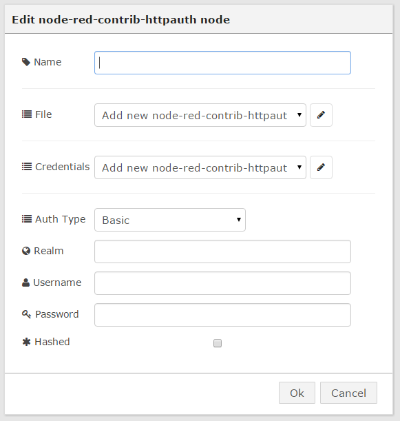
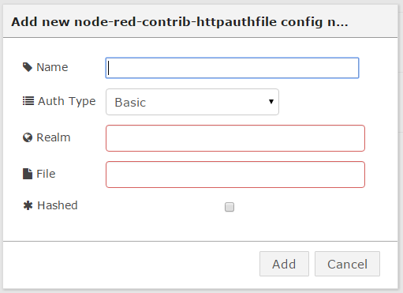
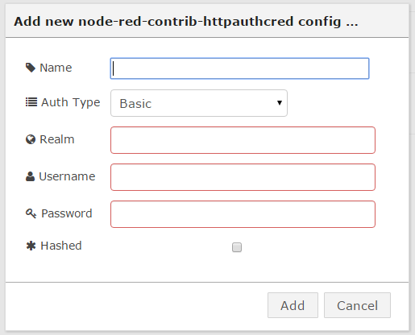

# node-red-contrib-httpauth
Node-RED node for HTTP Basic/Digest Auth

This Node-RED module performs Basic and Digest authentication.
It is to be used in conjunction with an http input node.

## Config ##

There are three type of configuration:

 1. File: the user credentials are stored in a file. (mutliple credentials)
 2. Shared: credentials shared which multiple nodes. (one credential)
 3. Not Shared: each node has it's own credentials. (one credential)

With all three config types you must specify the following:

 - Auth Type: what authentication type will be used: Basic, Digest
 - Realm: what realm will be used with this node
 - Hashed: are the passwords in the Password field or in the credentials file hashed.
   This field is only relavent if Auth Type is Digest. It has no effect on Basic.
   Hash format: MD5(Username:Realm:Password)

With Shared and Not Shared config types you must specify the following:

 - Username: the username
 - Password: the password
   If you entered a hashed password you must check the Hashed checkbox.

With File config type you must specify the following:

 - File: location of the file containing the credentials relative to the presently working directory
   If the password are hashed you must check the Hashed checkbox.

### File Configuration ###

### Shared config ###

